

# Smart Sales Force & POS System (Parfum Edition)

**Sistem manajemen distribusi dan kasir parfum terintegrasi dengan pelacakan lokasi sales real-time dan cetak struk bluetooth.**

---

## Preview Aplikasi

### Panel Administrator (Web Dashboard)
Tampilan desktop untuk memantau kinerja sales, stok gudang, dan laporan keuangan secara *real-time*.

<table>
  <tr>
    <td align="center" width="50%">
      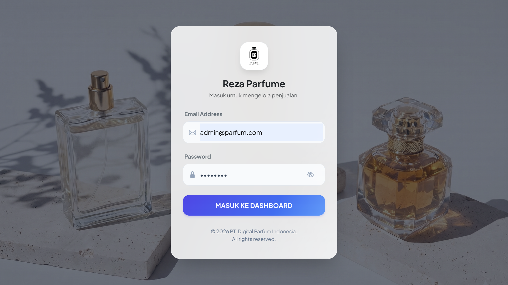
       <b>1. Form Login Administrator</b>
    </td>
    <td align="center" width="50%">
      
       <b>2. Dashboard Statistik Utama</b>
    </td>
  </tr>
  <tr>
    <td align="center">
      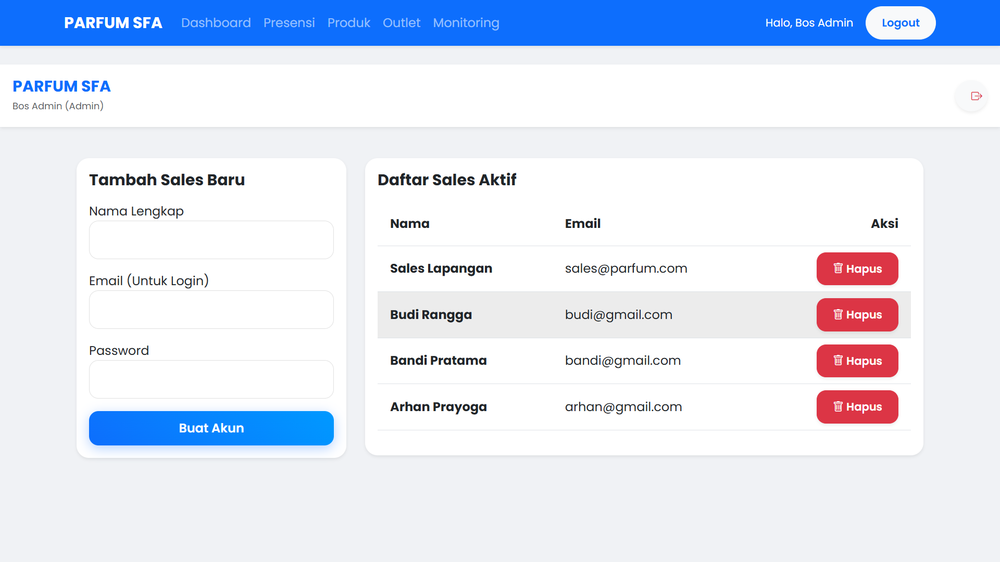
       <b>3. Manajemen Tim Sales</b>
    </td>
    <td align="center">
      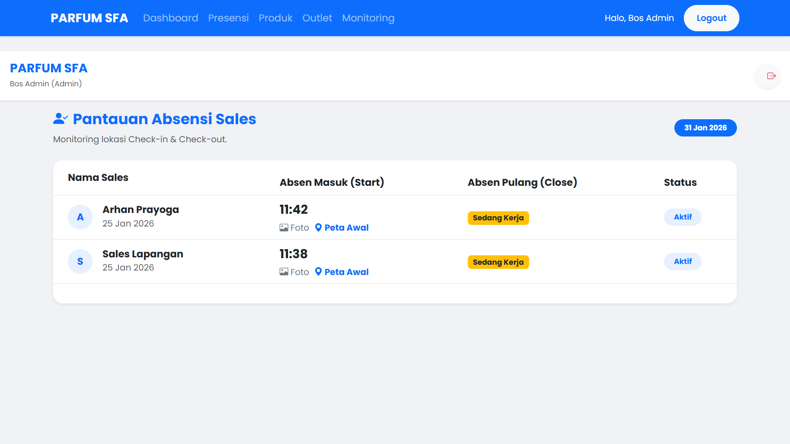
       <b>4. Real-time Monitoring Lokasi Sales</b>
    </td>
  </tr>
  <tr>
    <td align="center">
      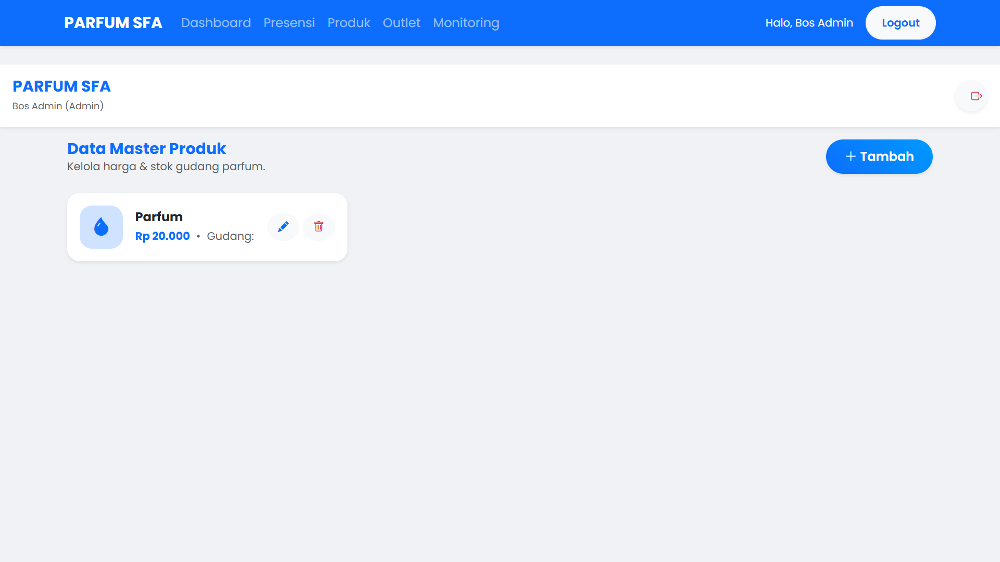
       <b>5. Manajemen Stok & Harga Produk</b>
    </td>
    <td align="center">
      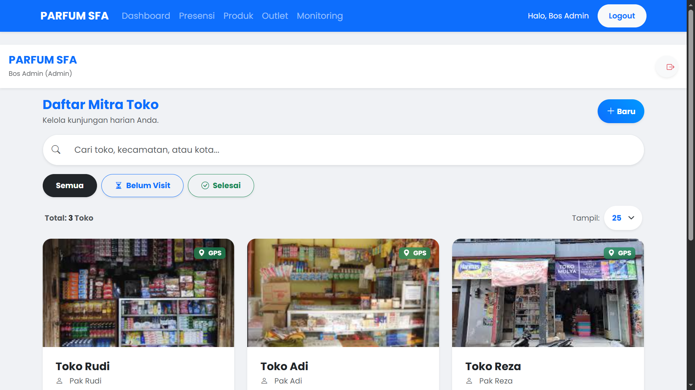
       <b>6. Direktori Data Outlet/Toko</b>
    </td>
  </tr>
  <tr>
    <td align="center">
      
       <b>7. Detail Riwayat Transaksi Outlet</b>
    </td>
    <td align="center">
      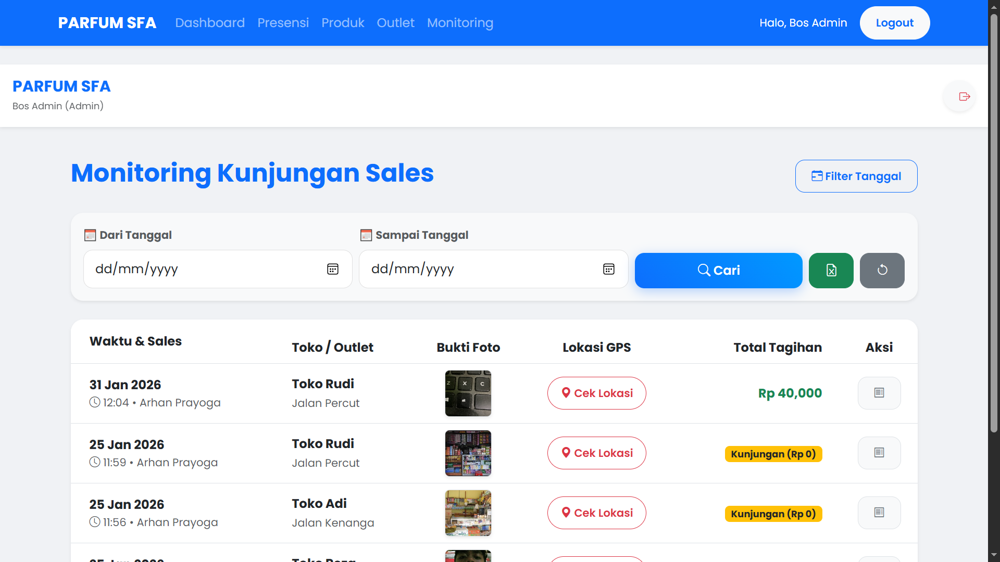
       <b>8. Peta Sebaran Kunjungan</b>
    </td>
  </tr>
  <tr>
    <td align="center" colspan="2">
      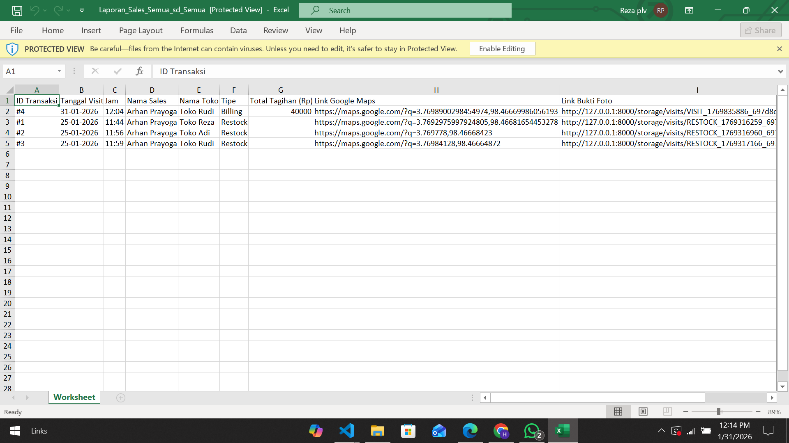
       <b>9. Ekspor Laporan Keuangan (Excel)</b>
    </td>
  </tr>
</table>

 

### Aplikasi Sales (Mobile View)
Antarmuka responsif untuk Sales melakukan absensi, kunjungan, dan transaksi di lapangan.

<table>
  <tr>
    <td align="center" width="33%">
      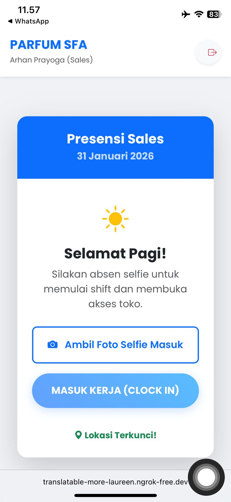
       <b>1. Presensi Masuk (GPS)</b>
    </td>
    <td align="center" width="33%">
      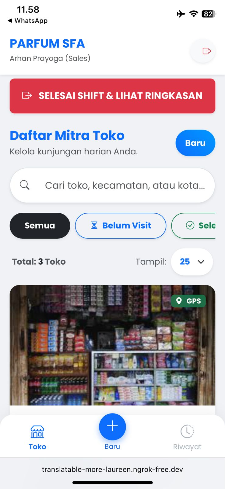
       <b>2. Dashboard Kinerja Sales</b>
    </td>
    <td align="center" width="33%">
      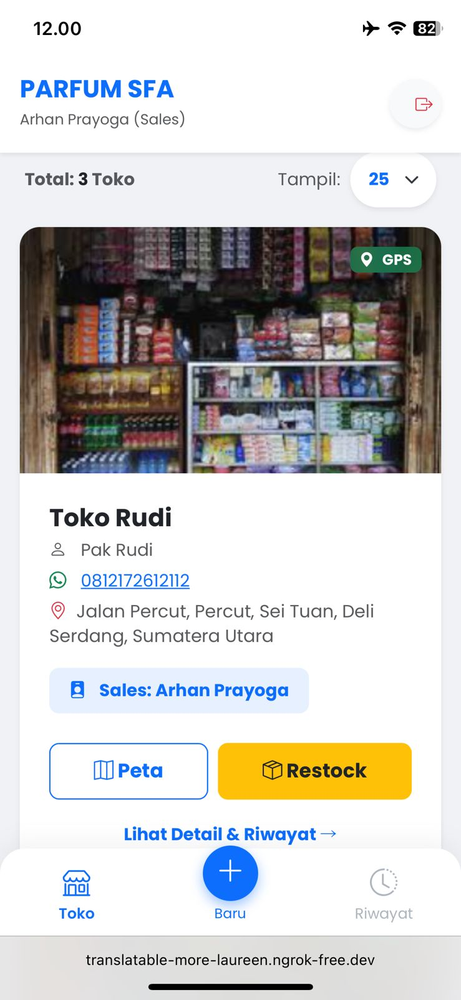
       <b>3. Daftar Target Outlet</b>
    </td>
  </tr>
  <tr>
    <td align="center">
      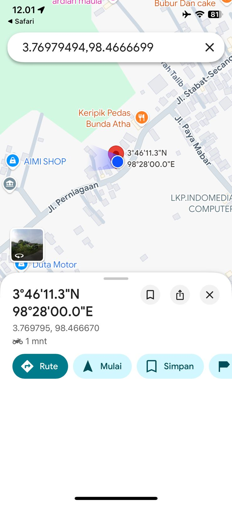
       <b>4. Validasi Titik Koordinat</b>
    </td>
    <td align="center">
      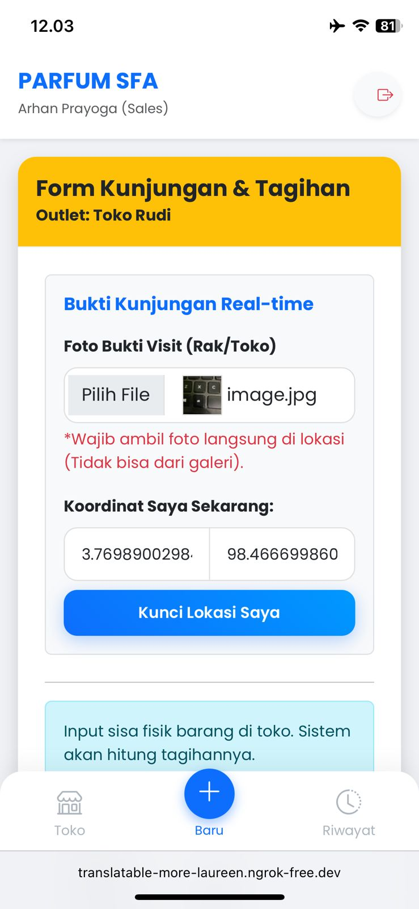
       <b>5. Form Kunjungan & Order</b>
    </td>
    <td align="center">
      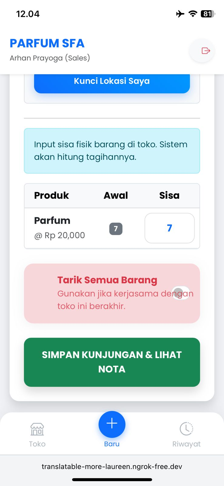
       <b>6. Keranjang Belanja</b>
    </td>
  </tr>
  <tr>
    <td align="center">
      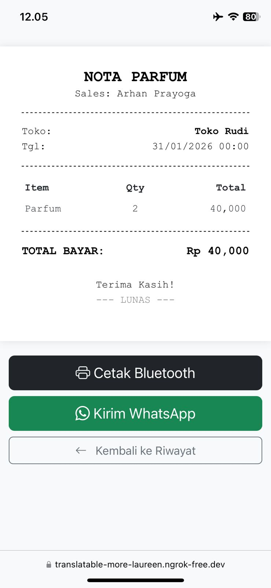
       <b>7. Nota Transaksi Digital</b>
    </td>
    <td align="center">
      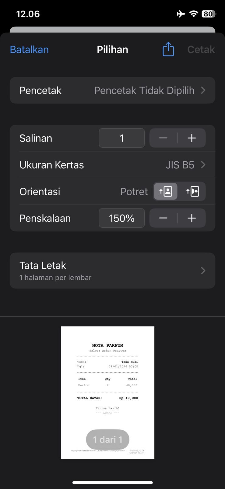
       <b>8. Cetak Struk Thermal (Bluetooth)</b>
    </td>
    <td align="center">
      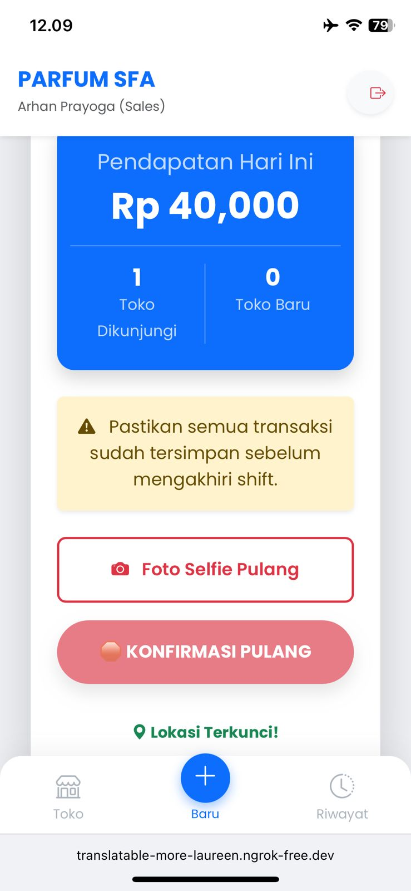
       <b>9. Presensi Pulang</b>
    </td>
  </tr>
  <tr>
    <td align="center" colspan="3">
      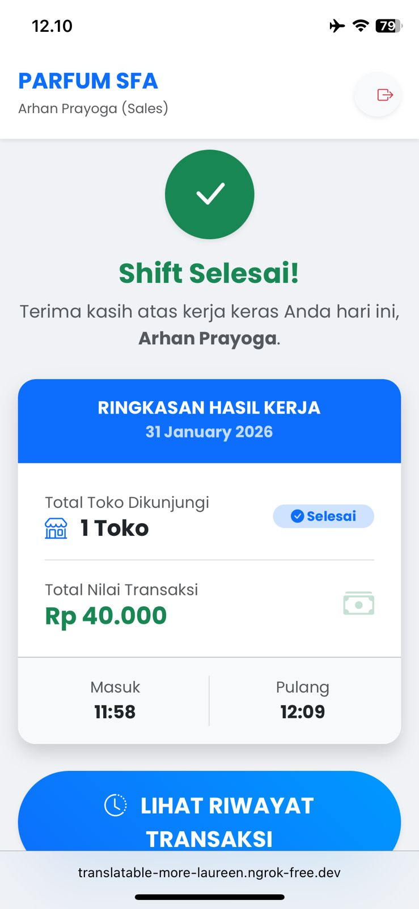
       <b>10. Ringkasan Hasil Kerja Harian</b>
    </td>
  </tr>
</table>

---

## Fitur Unggulan

### Untuk Administrator (Web)
* **Dashboard Analitik:** Grafik penjualan harian, total omzet, dan performa sales terbaik.
* **Live Tracking GPS:** Memantau posisi sales secara *real-time* saat jam kerja untuk mencegah kecurangan.
* **Manajemen Inventori:** Kelola stok masuk/keluar, harga modal, dan harga jual.
* **Database Outlet:** Menyimpan data pelanggan/toko beserta koordinat lokasi (Latitude/Longitude).
* **Laporan Keuangan:** Ekspor data penjualan otomatis ke format **Excel (.xlsx)** untuk pembukuan.
* **Role Management:** Hak akses khusus untuk Super Admin dan Admin Gudang.

### Untuk Sales Lapangan (Mobile)
* **Absensi Berbasis Lokasi (Geo-tagging):** Sales hanya bisa absen jika berada dalam radius lokasi yang ditentukan.
* **Mobile POS (Point of Sales):** Input pesanan langsung dari HP, hitung total otomatis.
* **Cetak Struk Bluetooth:** Integrasi dengan printer thermal (support RawBT) untuk cetak nota instan di toko.
* **Riwayat Kunjungan:** Mencatat bukti kunjungan (foto toko & lokasi) meskipun tidak ada transaksi.
* **Smart Routing:** Navigasi ke lokasi outlet menggunakan Google Maps.

---

## Tech Stack
* **Backend:** Laravel 12 (PHP)
* **Frontend:** Bootstrap 5, Blade Template
* **Database:** MySQL
* **Maps API:** Leaflet JS / Google Maps Integration
* **Printing:** ESC/POS Command (Support Bluetooth Thermal Printer)

---

## Penawaran Lisensi & Kustomisasi

Sistem ini **siap digunakan** (Ready to Use) untuk operasional bisnis distribusi harian Anda. 
Jika Anda tertarik untuk memiliki **Source Code Lengkap**, membeli lisensi, atau membutuhkan **kustomisasi fitur** (seperti integrasi HRD, Payroll, dll), silakan hubungi kami:

  
&nbsp;  **+62 831-3338-7676** &nbsp;  **hydenruok@gmail.com**

---

  <small>© 2026 Smart Sales POS System. All Rights Reserved.</small>

